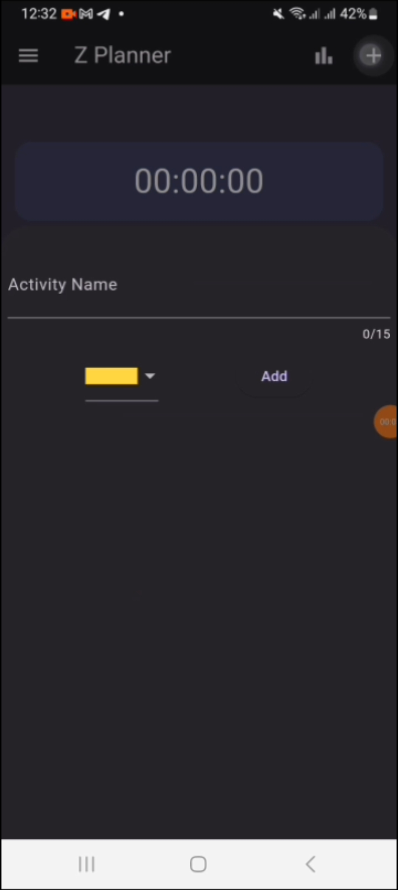
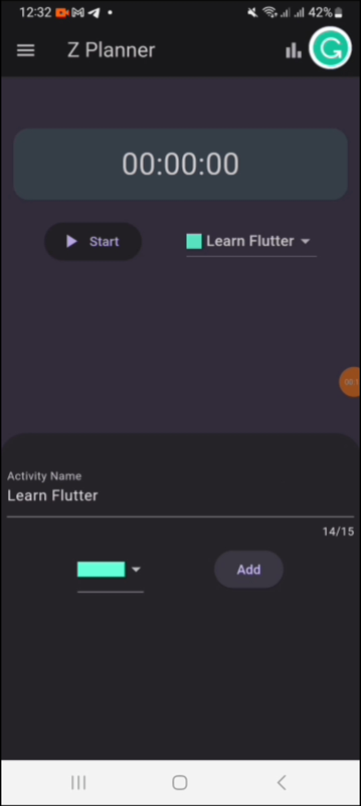
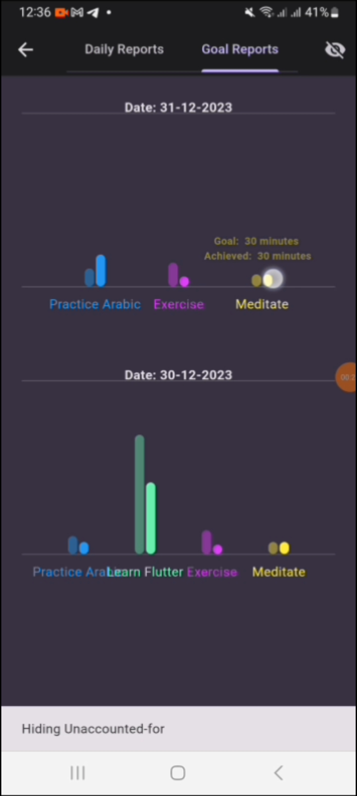
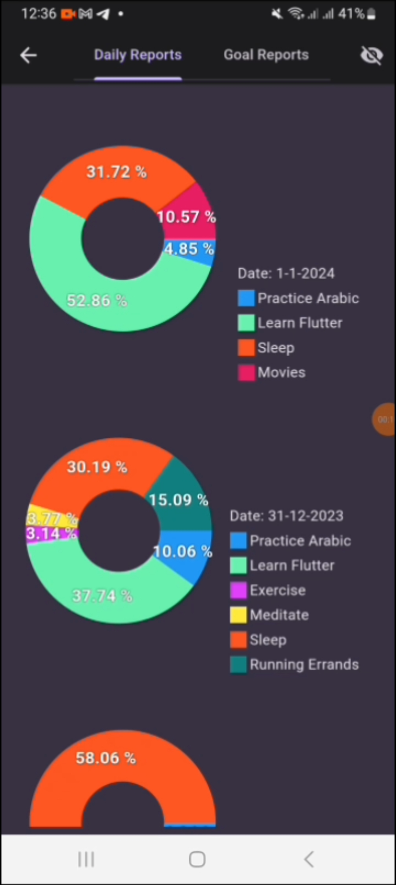

# Z Planner

**Z Planner** is a productivity and time-tracking app designed to help you monitor how much time you spend on tasks and activities. It is inspired by those days where we lose track of time and suddenly find ourselves asking where the day went. 

* My very first app. The pioneer of Undebugged App Series *

---

## Features

- **Time Tracking:** Start, pause, and stop timers for any activity.
- **Activity Management:** Organize your tasks and categorize them.
- **Analytics:** View detailed reports and charts showing how you spend your time.
- **Simple UI:** Easy-to-use interface for quick task tracking.

## Screenshots

| Home Screen | Add activity | 
|--------------|-----------|
|  |  |

| Goal Reports | Daily Reports |
|--------------|--------------|
|  |   |

## Demo Video

